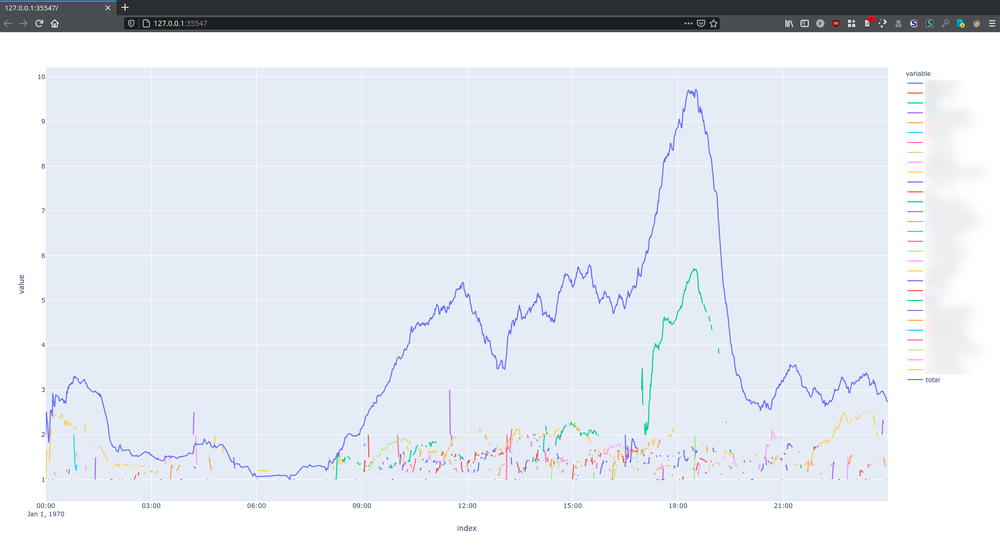

A python script to show daily activity on a Discord server based on a users data requested under GDPR.
I rushed this in an evening while procrastinating from university work.
It shows that im not all that experienced with python and never heard of pandas before today.
All in all the code quality is very much hackerton-grade. Decided to put it up on GitHub anyways in case someone wants to play with it.

Heres a quick guide on how to use it:
1. Install the dependencies. Everything besides plotly and pandas should already be on your system.
2. [Request your data from Discord.](https://support.discord.com/hc/en-us/articles/360004027692-Requesting-a-Copy-of-your-Data)
3. Wait a couple of hours or days to get a cringy email with the data
4. Download and extract it
5. Run the script. It will ask for the directory where the data was extracted, your time zone and which server you want to look at.
6. If it worked, a browser window with the graph should open.

Here's an image of what the result looks like:
